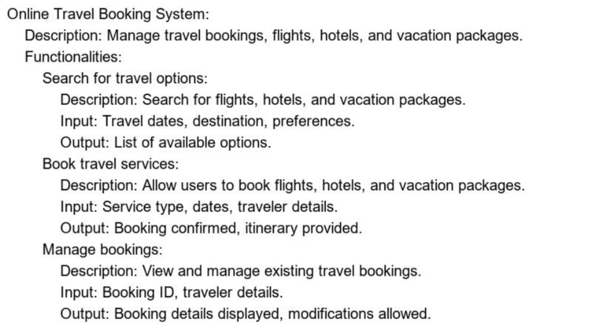

# Travel Booking System
Hi I am Kanishk mittal (2023BCY0003) and this is my mini project for following problem statment
For any queries, you can contact me at kanishkmittal2005@gmail.com.

## Key Features
- Booking Flights
- Booking Hotels
- Creating multiple users
- Managing multiple bookings
- Cancelling bookings
- Viewing bookings
## Folder Structure

## Basic Components
- User
- Flight
- Hotel
- Data
- Custom Exceptions
- Data Handler
- Main
## Working of each component
### 1) Main
This is the main file which is used to run the whole project. It is the entry point of the project and manage how different componets interact with each other.
### 2) User
This file contains the user class which is used to create user objects and maintain a record of all users in ths system like managing there booking and their data and all that stuff.
### 3) DataHandler
This is the most import and most used package in the project and it is further subdivided into two parts:
#### 3.1) Read Data 
This part is used to read data from the files and store it in the form of objects in the system.
#### 3.2) Write Data
This part is used to take objects as input and write them in their spefic csv files and if that file is not present then it will create a new file with some dummy data in it which we can replace with actual data in reald scenario.
### 4) Flight
This file contains the flight class which is used to create flight objects and maintain a record of all flights in the system like managing there booking and their data and all that stuff.
### 5) Hotel
This file contains the hotel class which is used to create hotel objects and maintain a record of all hotels in the system like managing there booking and their data and all that stuff.

## How to run?
- First clone the repository using the following command
`git clone "https://github.com/Kanishk-mittal/Travel-Booking-System"`

- then run the main.java file

## Sample run

### First Run without any data
```
      _   _  __            _____    ___     ___   __   __   ___     _       ___   
   _ | | | |/ /     o O O |_   _|  | _ \   /   \  \ \ / /  | __|   | |     / __|
  | || | | ' <     o        | |    |   /   | - |   \ V /   | _|    | |__   \__ \
  _\__/  |_|\_\   TS__[O]  _|_|_   |_|_\   |_|_|   _\_/_   |___|   |____|  |___/
_|"""""|_|"""""| {======|_|"""""|_|"""""|_|"""""|_| """"|_|"""""|_|"""""|_|"""""|
"`-0-0-'"`-0-0-'./o--000'"`-0-0-'"`-0-0-'"`-0-0-'"`-0-0-'"`-0-0-'"`-0-0-'"`-0-0-'
=========Welcome to JK travels one Stop for all your travel needs=========
Please create an account to continue
Enter username: kanishk
Enter password: kanishk
Enter email: kanishkmittal2005@gmail.com
Enter name: kanihsk
Enter address: nila hostel IIIT kottayam
Enter phone number: 1234567895
1. Book a flight
2.Cancel a flight
3. Book a hotel
4. Cancel a hotel
5. See your bookings
6. Exit
1
function called
  Flight Number ||          Origin ||     Destination || Price
_________________________________________________________________
              1 ||      Washington ||           Delhi || 50064.00
              2 ||         Londono ||          Moscow || 20054.00
              3 ||           Paris ||        New York || 30055.00
              4 ||         Beijing ||        Shanghai || 10053.00
              5 ||           Tokyo ||           Seoul || 15057.00
              6 ||     Los Angeles ||   San Francisco || 5063.00
              7 ||         Chicago ||        New York || 10051.00
              8 ||        New York ||      Washington || 5064.00
              9 ||           Delhi ||         Beijing || 20064.00
             10 ||          Moscow ||           Paris || 15069.00
             11 ||        Shanghai ||           Tokyo || 10057.00
             12 ||           Seoul ||     Los Angeles || 20065.00
             13 ||   San Francisco ||         Chicago || 10053.00
             14 ||        New York ||      Washington || 5053.00
             15 ||      Washington ||           Delhi || 50056.00
             16 ||         Londono ||          Moscow || 20050.00
             17 ||           Paris ||        New York || 30052.00
             18 ||         Beijing ||        Shanghai || 10068.00
             19 ||           Tokyo ||           Seoul || 15066.00
             20 ||     Los Angeles ||   San Francisco || 5061.00
Enter the flight number you want to book: 1
Seats available for flight 1
Day 1: 58
Day 2: 68
Day 3: 63
Day 4: 55
Day 5: 65
Day 6: 55
Day 7: 64
Day 8: 64
Day 9: 58
Day 10: 64
Day 11: 52
Day 12: 67
Day 13: 57
Day 14: 65
Day 15: 57
Day 16: 50
Day 17: 59
Day 18: 61
Day 19: 53
Day 20: 64
Day 21: 67
Day 22: 60
Day 23: 51
Day 24: 65
Day 25: 51
Day 26: 61
Day 27: 56
Day 28: 54
Day 29: 60
Day 30: 63
Enter the date you want to book: 25
Are you sure you want to book flight no 1 on 25? (yes/no)
yes
Flight booked successfully
1. Book a flight
2.Cancel a flight
3. Book a hotel
4. Cancel a hotel
5. See your bookings
6. Exit
5
===BOOKED FLIGHT===
Flight Number: 1
Origin: Washington
Destination: Delhi
Price: 50064.0
1. Book a flight
2.Cancel a flight
3. Book a hotel
4. Cancel a hotel
5. See your bookings
6. Exit
3
Hotels available
       Hotel ID      Hotel Name        Location           Price
              1       Taj Hotel      Washington        10061.00
              2         Marriot          London        20068.00
              3           Hyatt           Paris        30057.00
              4     Grand Hotel         Beijing        10056.00
              5        The Ritz           Tokyo        15058.00
              6   The Peninsula     Los Angeles         5051.00
              7 The Four Seasons         Chicago        10058.00
              8       The Plaza        New York         5059.00
              9      The Oberoi           Delhi        20063.00
             10        The Ritz          Moscow        15057.00
             11   The Peninsula        Shanghai        10052.00
             12 The Four Seasons           Seoul        20055.00
             13       The Plaza   San Francisco        10054.00
             14      The Oberoi        New York         5069.00
             15       Taj Hotel      Washington        10054.00
             16         Marriot          London        20053.00
             17           Hyatt           Paris        30058.00
             18     Grand Hotel         Beijing        10058.00
             19        The Ritz           Tokyo        15055.00
             20   The Peninsula     Los Angeles         5062.00
Enter the hotel number you want to book: 10
Rooms available for hotel 10
Day   1 :- 55

Day   2 :- 67

Day   3 :- 59

Day   4 :- 55

Day   5 :- 56

Day   6 :- 52

Day   7 :- 66

Day   8 :- 68

Day   9 :- 68

Day  10 :- 54

Day  11 :- 66

Day  12 :- 54

Day  13 :- 61

Day  14 :- 51

Day  15 :- 56

Day  16 :- 54

Day  17 :- 62

Day  18 :- 53

Day  19 :- 63

Day  20 :- 53

Day  21 :- 53

Day  22 :- 63

Day  23 :- 62

Day  24 :- 64

Day  25 :- 55

Day  26 :- 51

Day  27 :- 60

Day  28 :- 62

Day  29 :- 57

Day  30 :- 68

Enter the date and no of days you want to book: 29
2
Are you sure you want to book hotel no 10 on 29 for 2 days ? (yes/no)
yes
Hotel booked successfully
1. Book a flight
2.Cancel a flight
3. Book a hotel
4. Cancel a hotel
5. See your bookings
6. Exit
5
===BOOKED FLIGHT===
Flight Number: 1
Origin: Washington
Destination: Delhi
Price: 50064.0
===BOOKED HOTEL===
Hotel ID: 10
Hotel Name: The Ritz
Location: Moscow
Price: 15057.0
Booked for the following dates: 29 ,30 ,
1. Book a flight
2.Cancel a flight
3. Book a hotel
4. Cancel a hotel
5. See your bookings
6. Exit
6
```

### Second Run with data

```
      _   _  __            _____    ___     ___   __   __   ___     _       ___

   _ | | | |/ /     o O O |_   _|  | _ \   /   \  \ \ / /  | __|   | |     / __|
  | || | | ' <     o        | |    |   /   | - |   \ V /   | _|    | |__   \__ \
  _\__/  |_|\_\   TS__[O]  _|_|_   |_|_\   |_|_|   _\_/_   |___|   |____|  |___/
_|"""""|_|"""""| {======|_|"""""|_|"""""|_|"""""|_| """"|_|"""""|_|"""""|_|"""""|
"`-0-0-'"`-0-0-'./o--000'"`-0-0-'"`-0-0-'"`-0-0-'"`-0-0-'"`-0-0-'"`-0-0-'"`-0-0-'
=========Welcome to JK travels one Stop for all your travel needs=========     
1. Login
2. Create new account
1
Enter username: kanishk
Enter password: kanishk
1. Book a flight
2.Cancel a flight
3. Book a hotel
4. Cancel a hotel
5. See your bookings
6. Exit
5
===BOOKED FLIGHT===
Flight Number: 1
Origin: Washington
Destination: Delhi
Price: 50064.0
===BOOKED HOTEL===
Hotel ID: 10
Hotel Name: The Ritz
Location: Moscow
Price: 15057.0
Booked for the following dates: 29 ,30 ,
1. Book a flight
2.Cancel a flight
3. Book a hotel
4. Cancel a hotel
5. See your bookings
6. Exit
2
Do you really want to cancel your following flight?(yes/no)
Flight Number: 1
Origin: Washington
Destination: Delhi
Price: 50064.0
yes
Flight cancelled successfully
1. Book a flight
2.Cancel a flight
3. Book a hotel
4. Cancel a hotel
5. See your bookings
6. Exit
5
===BOOKED HOTEL===
Hotel ID: 10
Hotel Name: The Ritz
Location: Moscow
Price: 15057.0
Booked for the following dates: 29 ,30 ,
1. Book a flight
2.Cancel a flight
3. Book a hotel
4. Cancel a hotel
5. See your bookings
6. Exit
4
1. Book a flight
2.Cancel a flight
3. Book a hotel
4. Cancel a hotel
5. See your bookings
6. Exit
5
1. Book a flight
2.Cancel a flight
3. Book a hotel
4. Cancel a hotel
5. See your bookings
6. Exit
6
```

## Data in files after first execution

### Flight.csv
```
1,Washington,Delhi,50064.0,59,68,63,55,65,55,64,64,58,64,52,67,57,65,57,50,59,61,53,64,67,60,51,65,50,61,56,54,60,63
2,Londono,Moscow,20054.0,52,60,58,59,63,58,65,56,69,53,57,58,57,55,58,50,55,55,63,56,56,66,60,69,54,56,54,50,67,62
3,Paris,New York,30055.0,63,51,59,68,60,60,56,64,58,52,52,59,50,54,64,66,52,54,60,50,57,58,65,69,55,68,57,62,53,67
4,Beijing,Shanghai,10053.0,60,60,62,64,65,53,57,53,68,64,58,57,66,61,67,52,65,54,52,61,63,62,62,62,65,63,55,57,53,66
5,Tokyo,Seoul,15057.0,52,51,55,58,56,58,51,63,68,65,58,51,68,65,50,65,57,52,52,64,57,69,62,64,58,54,67,53,58,60
6,Los Angeles,San Francisco,5063.0,51,56,62,63,65,58,52,57,56,56,51,53,55,67,63,61,62,55,69,59,51,57,55,56,50,63,50,50,57,60
7,Chicago,New York,10051.0,67,68,57,50,60,65,58,50,57,52,65,66,59,50,68,56,68,54,63,60,65,69,60,55,51,57,65,56,54,58
8,New York,Washington,5064.0,62,55,68,62,60,64,62,55,61,58,67,54,68,58,52,61,51,58,60,60,61,59,56,68,53,58,51,63,53,52
9,Delhi,Beijing,20064.0,65,57,53,52,57,51,63,55,51,61,65,59,69,58,55,59,68,61,66,64,51,52,56,51,55,61,54,51,68,58
10,Moscow,Paris,15069.0,65,64,53,65,54,59,58,59,59,63,63,51,53,62,59,63,52,51,58,52,63,67,54,55,68,69,53,54,65,66
11,Shanghai,Tokyo,10057.0,64,67,50,69,57,67,68,64,53,59,69,63,64,62,58,58,53,60,69,61,63,69,57,50,69,50,54,51,62,62
12,Seoul,Los Angeles,20065.0,51,63,67,62,58,62,66,54,52,56,50,51,56,51,56,69,69,59,68,67,53,64,58,54,58,56,68,57,50,53
13,San Francisco,Chicago,10053.0,54,65,52,54,63,68,66,64,55,68,62,57,68,60,50,54,50,64,62,51,68,65,64,63,60,55,62,68,66,56
14,New York,Washington,5053.0,59,58,61,54,56,67,69,68,65,52,62,55,66,68,57,62,65,56,55,65,53,52,58,60,62,63,60,59,62,63
15,Washington,Delhi,50056.0,51,58,62,56,57,52,50,55,57,52,62,63,65,52,53,66,62,67,55,67,67,50,51,62,55,68,51,56,56,60
16,Londono,Moscow,20050.0,50,50,64,63,69,61,66,61,67,58,66,60,68,50,59,65,59,52,61,57,50,68,64,68,67,68,53,56,56,50
17,Paris,New York,30052.0,60,50,68,68,62,63,54,53,66,64,61,66,64,69,60,66,53,60,66,57,50,69,53,65,59,64,66,51,62,54
18,Beijing,Shanghai,10068.0,54,63,63,61,62,64,65,69,60,50,55,60,59,62,69,50,68,51,69,54,62,60,56,66,66,55,58,60,69,60
19,Tokyo,Seoul,15066.0,64,55,55,59,51,50,62,62,51,61,67,61,65,68,53,61,51,53,64,58,55,52,63,58,65,53,61,54,50,60
20,Los Angeles,San Francisco,5061.0,50,56,58,51,61,62,64,64,65,66,52,58,55,57,55,65,54,58,61,63,60,51,51,50,58,66,63,51,55,52

```

### Hotel.csv
```
1,Taj Hotel,Washington,10061.0,63,53,68,54,62,69,55,66,69,57,53,55,63,57,69,58,57,63,67,62,68,54,69,55,68,66,67,51,68,66
2,Marriot,London,20068.0,62,57,66,59,50,61,58,56,53,69,67,67,61,54,61,66,57,55,62,54,68,54,69,50,58,62,60,66,57,52
3,Hyatt,Paris,30057.0,66,51,60,56,57,59,67,66,61,67,65,68,60,61,60,63,67,54,62,66,63,63,58,52,55,50,56,61,67,60
4,Grand Hotel,Beijing,10056.0,59,63,51,54,57,55,57,68,52,53,51,66,63,53,66,64,57,62,59,64,53,53,60,65,50,68,68,52,63,55
5,The Ritz,Tokyo,15058.0,57,56,69,62,67,67,59,57,66,68,60,52,55,50,68,67,61,51,51,63,68,60,60,50,53,62,51,68,62,63
6,The Peninsula,Los Angeles,5051.0,50,63,53,65,57,62,69,67,63,52,64,55,63,51,58,51,60,63,54,53,55,61,68,68,59,57,53,52,66,50
7,The Four Seasons,Chicago,10058.0,54,68,60,55,55,63,69,64,54,54,67,59,50,58,56,66,52,59,50,63,69,63,57,53,66,51,64,58,59,55
8,The Plaza,New York,5059.0,64,69,67,59,66,52,66,65,55,58,59,62,50,69,64,58,66,57,52,62,60,66,64,64,62,69,59,62,59,55
9,The Oberoi,Delhi,20063.0,64,64,57,67,61,60,65,55,53,51,54,61,69,50,62,64,52,69,62,62,64,50,66,50,66,67,59,51,68,68
10,The Ritz,Moscow,15057.0,55,67,59,55,56,52,66,68,68,54,66,54,61,51,56,54,62,53,63,53,53,63,62,64,55,51,60,62,56,67
11,The Peninsula,Shanghai,10052.0,64,61,58,61,52,58,57,56,65,56,57,50,66,65,66,51,52,56,62,69,68,63,65,66,65,64,53,50,62,59
12,The Four Seasons,Seoul,20055.0,59,69,54,63,61,64,69,64,52,66,64,58,54,66,63,65,59,60,69,59,65,51,60,66,58,50,55,67,53,56
13,The Plaza,San Francisco,10054.0,57,60,54,60,57,67,59,54,51,66,54,66,62,58,68,66,63,65,52,54,52,54,60,63,51,67,66,54,56,55
14,The Oberoi,New York,5069.0,51,66,63,52,69,55,62,57,52,60,63,65,51,51,62,67,56,53,55,66,59,56,61,52,67,61,54,63,51,59
15,Taj Hotel,Washington,10054.0,57,64,53,66,52,60,61,55,53,63,66,64,57,53,60,63,55,50,62,68,63,57,61,66,65,58,62,63,51,63
16,Marriot,London,20053.0,54,65,59,54,59,52,54,69,64,60,66,54,60,57,66,68,60,58,60,58,63,65,62,60,52,67,64,59,57,65
17,Hyatt,Paris,30058.0,64,53,69,57,50,66,56,52,55,64,65,53,51,50,67,60,68,58,57,69,56,62,57,69,60,53,52,64,57,54
18,Grand Hotel,Beijing,10058.0,54,61,54,62,54,61,64,51,61,59,55,63,56,50,59,60,52,50,63,61,63,51,52,62,61,63,65,58,68,64
19,The Ritz,Tokyo,15055.0,54,66,61,54,61,68,64,66,59,59,60,60,60,57,56,67,51,68,57,59,58,52,57,51,60,62,54,68,50,69
20,The Peninsula,Los Angeles,5062.0,69,68,57,65,52,66,53,69,53,62,51,64,67,62,57,61,63,66,66,60,67,69,53,54,63,54,67,61,67,56
```

### Users.csv
```
kanishk|kanishk|kanishkmittal2005@gmail.com|kanihsk|nila hostel IIIT kottayam|1234567895|-1|-1|-1|[]

```